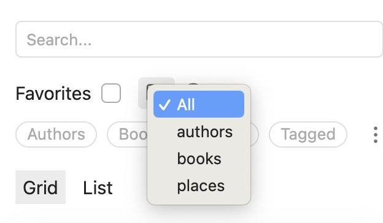
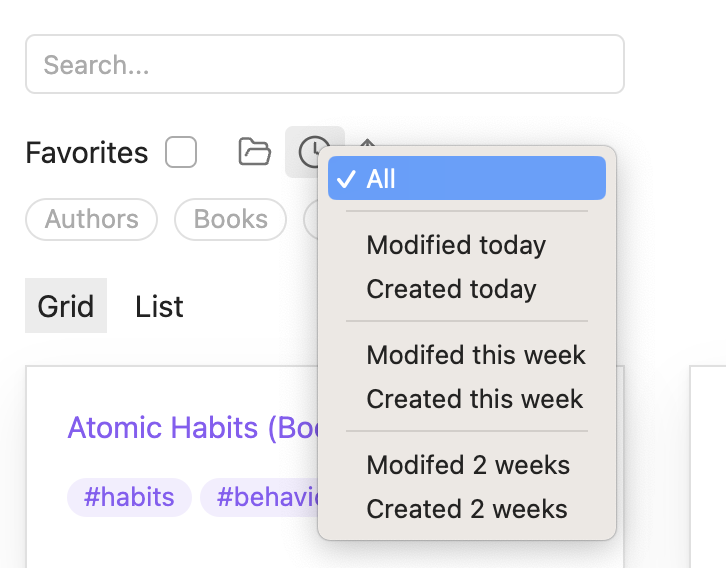
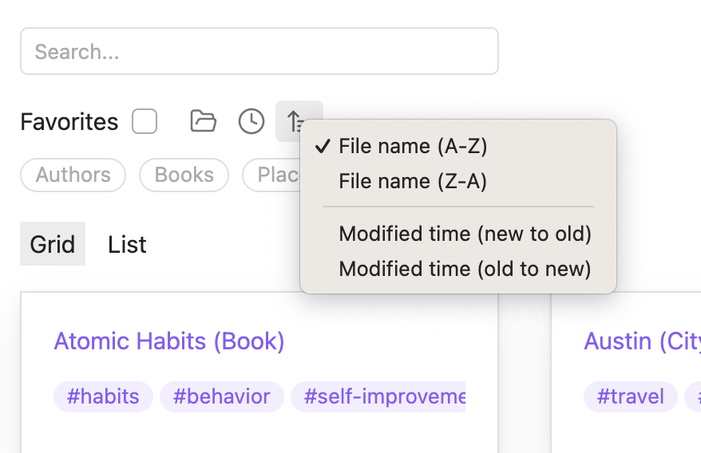

# Obsidian Vault Explorer

Vault Explorer is an [Obsidian.md](https://obsidian.md) plugin for desktop only. It allows you to explore your vault in visual format.

This plugin is a replacement for most of the functionality found in [DataLoom](https://github.com/decaf-dev/obsidian-dataloom). It has been written in Svelte for faster speed, smaller build size, and easier contributions.

Find detailed documentation at [vaultexplorer.com](https://vaultexplorer.com)

## Table of contents

-   [Screenshots](#screenshots)
-   [Installation](#installation)
-   [Usage](#usage)
-   [Premium](#premium)
-   [Network requests](#network-requests)
-   [Contributing](#contributing)
-   [Support](#support)
-   [License](#license)

## Screenshots

### List view

### Grid view

### Folder filter

### Time filter

### Sort filter

### Property filter

## Installation

1. In Obsidian, open **Settings**
2. Go to **Community plugins**
3. Click **Browse**
4. Search for **Vault Explorer** by **DecafDev**
5. Click **Install**
6. Finally, click **Enable**

## Usage

Click the compass button on the left-hand sidebar to open the vault explorer view.

## Premium

Premium features are available to users who purchase a [Vault Explorer license](https://vaultexplorer.com/docs/premium).

## Network requests

When the license key setting is empty, no network requests are made by the plugin.

When the license key setting is not empty, several network requests are made to the Vault Explorer API. These requests only send the license key you entered and a device ID generated by the plugin.

Vault Explorer does not include any client-side telemetry.

## Contributing

For information on how to contribute to Vault Explorer, please read the [CONTRIBUTING.md](CONTRIBUTING.md).

## Support

## License

Vault Explorer is distributed under [MIT License](https://github.com/decaf-dev/obsidian-vault-explorer/blob/master/LICENSE).
