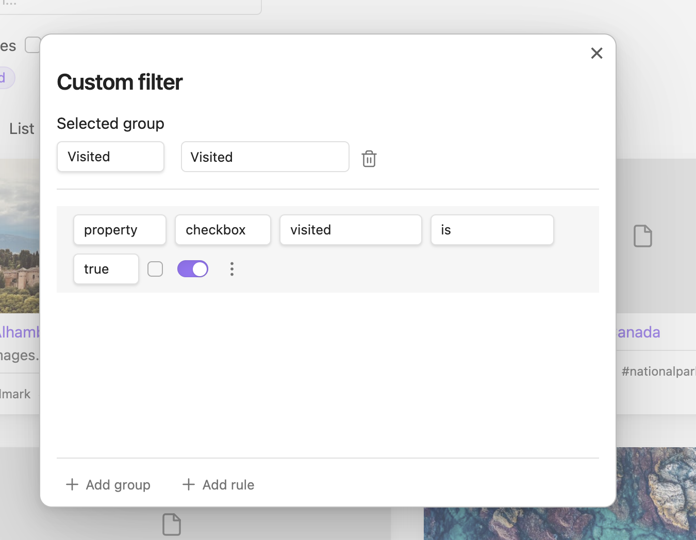
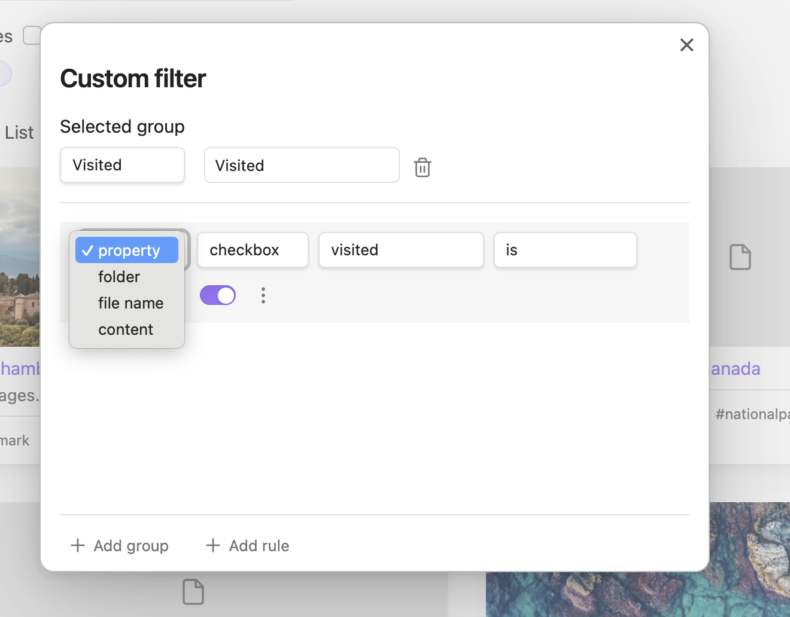
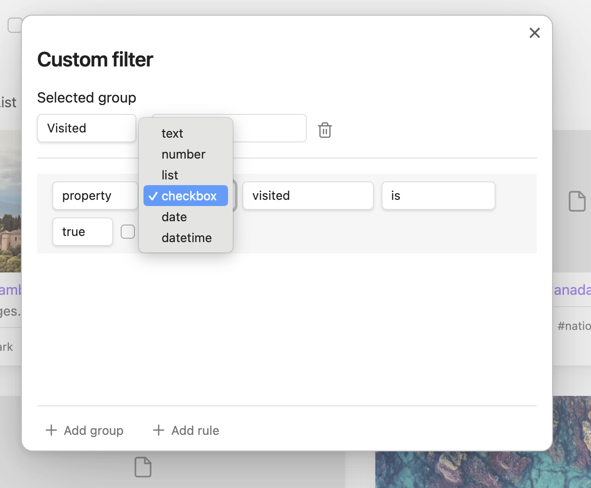

# Obsidian Vault Explorer

Find detailed documentation at [vaultexplorer.com](https://vaultexplorer.com)

Vault Explorer is an [Obsidian](https://obsidian.md) plugin that leverages frontmatter properties to help you explore and organize your vault files.

The goal of Vault Explorer is to solve three main problems:

1. How to easily filter by groups of frontmatter properties and other file data.
2. How to display frontmatter properties in meaningful visual layouts.
3. How to create a social media-like experience using just your personal data.

Vault Explorer is a work in progress. Please check the GitHub repository and documentation website regularly for updates.

## Table of contents

-   [Screenshots](#screenshots)
-   [Installation](#installation)
-   [Usage](#usage)
-   [Premium](#premium)
-   [Features](#features)
-   [Network use](#network-use)
-   [Contributing](#contributing)
-   [Support](#support)
-   [License](#license)

## Screenshots

### Grid view

### List view

### Feed view

### Custom filter

 

 

### Favorites

### Timestamp filter

### Sort filter

### Search filter

## Installation

1. In Obsidian, open **Settings**
2. Go to **Community plugins**
3. Click **Browse**
4. Search for **Vault Explorer** by **DecafDev**
5. Click **Install**
6. Finally, click **Enable**

## Usage

Click the compass button on the left-hand sidebar to open the vault explorer view.

## Premium

Premium features are available to users who purchase a [Vault Explorer license](https://vaultexplorer.com/docs/premium/).

Please do not share your license key with anyone. Shared license keys will be deactivated.

## Features

| Name                                                                           | Categories           | Documented |
| ------------------------------------------------------------------------------ | -------------------- | ---------- |
| Move focus with left and right arrows                                          | Accessibility        | ✅         |
| See an image placeholder on the grid card                                      | Cover image          |            |
| Load images from the `image-property`, `url-property`, `frontmatter` or `body` | Cover image          | ✅         |
| Change the order of cover image source loading                                 | Cover image, Setting | ✅         |
| Enable/disable cover image sources                                             | Cover image, Setting | ✅         |
| Cache social media images                                                      | Cover image          | ✅         |
| Filter files by favorite property                                              | Favorites filter     | ✅         |
| Favorites support for non-markdown files                                       | Favorites filter     | ✅         |
| Add to favorites button in context menu                                        | Favorites filter     | ✅         |
| Remove from favorites button in context menu                                   | Favorites filter     | ✅         |
| See a favorite icon in the grid card                                           | Favorites filter     |            |
| Reorder the filter group list                                                  | Filter group         | ✅         |
| Add a filter group                                                             | Filter group         | ✅         |
| Delete a filter group                                                          | Filter group         | ✅         |
| Set a filter group as sticky                                                   | Filter group         | ✅         |
| Unset a filter group as sticky                                                 | Filter group         | ✅         |
| Right click to edit a filter group item                                        | Filter group         |            |
| Add a filter rule                                                              | Filter rule          | ✅         |
| Delete a filter rule                                                           | Filter rule          | ✅         |
| Duplicate a filter rule                                                        | Filter rule          | ✅         |
| Match when property doesn't exist toggle                                       | Filter rule          |            |
| Filter files by folder                                                         | Filter rule          |            |
| Filter by frontmatter property                                                 | Filter rule          | ✅         |
| Select a condition                                                             | Filter rule          | ✅         |
| Select a logical operator: `and`, `or`                                         | Filter rule          | ✅         |
| Filter files by folder                                                         | Filter rule          | ✅         |
| Filter files by file content                                                   | Filter rule          | ✅         |
| Filter files by file name                                                      | Filter rule          | ✅         |
| Enable/disable a filter rule                                                   | Filter rule          | ✅         |
| Set the log level                                                              | Logging              | ✅         |
| Filter by search                                                               | Search filter        | ✅         |
| Set page size                                                                  | Setting              | ✅         |
| Set property for modification date                                             | Setting              | ✅         |
| Set property for creation date                                                 | Setting              | ✅         |
| Set a url property                                                             | Setting              | ✅         |
| Set a favorite property                                                        | Setting              | ✅         |
| Set custom text property                                                       | Setting              | ✅         |
| Toggle file icons                                                              | Setting              | ✅         |
| Change the filter groups wrap                                                  | Setting              | ✅         |
| Enable/disable loading the social media image                                  | Setting              | ✅         |
| Change the collapse style for feed content                                     | Setting              | ✅         |
| Remove H1 from feed content                                                    | Setting              | ✅         |
| Remove markdown from feed content                                              | Setting              | ✅         |
| Enable/disable tags on a list item                                             | Setting              | ✅         |
| Change the plugin configuration folder                                         | Setting, Data        | ✅         |
| Clear the social media cache                                                   | Setting, Data        | ✅         |
| Change the feed content line clamp for small screens                           | Setting, Feed view   | ✅         |
| Change the feed content line clamp for medium screens                          | Setting, Feed view   | ✅         |
| Change the feed content line clamp for large screens                           | Setting, Feed view   | ✅         |
| Enter a license key                                                            | Setting, License     | ✅         |
| Sort by title: `asc`, `desc`                                                   | Sort order           | ✅         |
| Sort by modification date: `asc`, `desc`                                       | Sort order           | ✅         |
| Randomly sort files                                                            | Sort order           | ✅         |
| Filter by creation date: `1 day`, `1 week`, `2 weeks`                          | Timestamp filter     | ✅         |
| Filter by modification date: `1 day`, `1 week`, `2 weeks`                      | Timestamp filter     | ✅         |
| See vault files in a grid view                                                 | View                 | ✅         |
| See vault files in a list view                                                 | View                 | ✅         |
| See vault files in a feed view                                                 | View                 | ✅         |
| Change the view list order                                                     | View                 |            |
| Limit displayed files with pagination                                          | View                 |            |
| Search for a tag when clicked                                                  | View                 | ✅         |
| See a file preview when mouse hovers link and ctrl/cmd is pressed              | View                 |            |
| Search for property when clicked                                               | View                 | ✅         |
| See files icons next to the file name                                          | View                 | ✅         |

## Network use

Vault Explorer is a privacy friendly plugin.

When you access the grid view, Vault Explorer will make requests to the URL's that you specify to display cover images. You may disable this behavior in the settings.

Besides cover image fetching, Vault Explorer does not make any network requests.

Vault Explorer does not include any client-side telemetry.

## Contributing

Contributions are welcome! Please read the [CONTRIBUTING.md](CONTRIBUTING.md) to get started.

## License

Vault Explorer is distributed under [MIT License](https://github.com/decaf-dev/obsidian-vault-explorer/blob/master/LICENSE).
